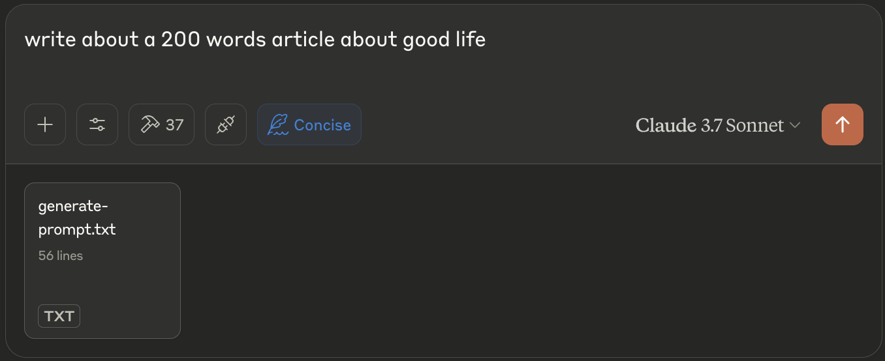

# Swift Prompter

An MCP server implementation that brings Google's research-backed prompt engineering techniques directly to Claude. Swift Prompter operationalizes the strategies from Google's Prompt Engineering whitepaper, delivering proven patterns for more effective AI interactions.



## Features

* **Research-Backed Templates**: Pre-built implementations of Google's recommended prompt patterns
* **Guided Reasoning Patterns**: Chain-of-Thought, ReAct, and Step-Back techniques for complex problem solving
* **Systematic Process**: Framework for selecting optimal prompt patterns based on task type
* **Context Efficiency**: Monitors token usage to maximize reasoning space
* **Zero Configuration**: Ready-to-use patterns with no template creation needed

## Tools

* **list-templates**
  * Lists available prompt templates
  * Inputs:
    * `search` (string, optional): Filter templates by name or description
    * `tag` (string, optional): Filter templates by tag

* **get-template**
  * Retrieves a specific template by ID
  * Inputs:
    * `template_id` (string): ID of the template to retrieve

* **build-prompt**
  * Constructs optimized prompts from templates and input values
  * Inputs:
    * `template_id` (string): Template to use
    * `inputs` (object): Values for template variables

* **context-status**
  * Checks current context utilization and provides recommendations
  * No inputs required

## Implemented Techniques from Google's Whitepaper

Swift Prompter provides ready-to-use implementations of key techniques from Google's prompt engineering research:

* **Chain-of-Thought**: Improves reasoning by guiding Claude through step-by-step thinking
* **ReAct**: Combines reasoning and action in a structured thought-action-observation loop
* **Role Prompting**: Establishes specific expertise contexts for specialized tasks
* **Few-Shot Learning**: Provides examples for Claude to follow similar patterns
* **Self-Consistency**: Generates multiple reasoning paths to verify consistency
* **Step-Back Prompting**: Tackles complex problems by examining from higher abstraction levels
* **Structured Output**: Enforces JSON or other specific format requirements

Each technique is implemented as a pre-configured template, optimized based on Google's research findings.

## Configuration

### Docker

The docker image is available on Docker Hub:
```
docker pull lumixlabs/swift-prompter:latest
```

### Usage with Claude Desktop

Add this to your `claude_desktop_config.json`:

```json
{
  "mcpServers": {
    "swift-prompter": {
      "command": "docker",
      "args": [
        "run",
        "-i",
        "--rm",
        "-w",
        "/",
        "lumixlabs/swift-prompter"
      ]
    }
  }
}
```

## Workflow Implementation

Swift Prompter enforces the research-backed workflow for optimal AI responses:

1. **Technique Selection**: Automatically identifies the best prompt pattern for each task type
2. **Structured Prompting**: Applies the selected technique with proper framing and constraints
3. **Guided Execution**: Directs Claude to follow specific cognitive processes based on the task
4. **Context Management**: Optimizes token usage to maximize reasoning space

## Scientific Foundation

This implementation is based directly on Google's comprehensive prompt engineering research:
* Documented techniques from "Prompt Engineering: A Practical Guide" (Google, 2023)
* Empirically validated patterns showing 20-50% performance improvements on reasoning tasks
* Systematic approach to selecting techniques based on task requirements

## License

This project is licensed under the Apache License 2.0 - see the LICENSE file for details.